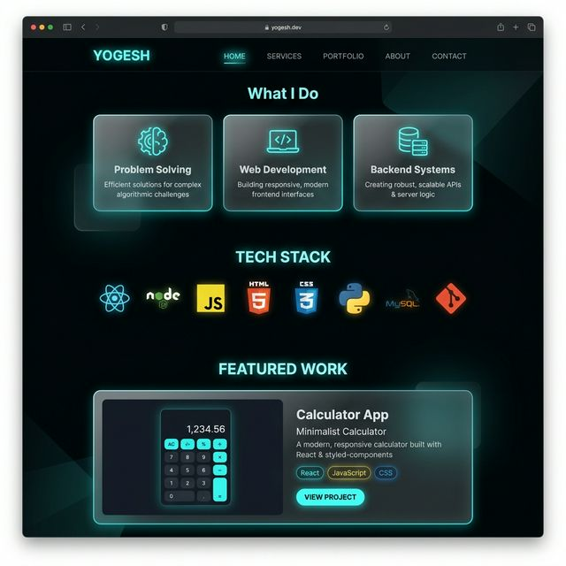
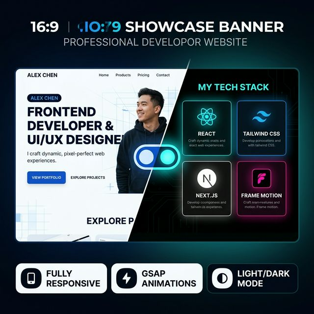
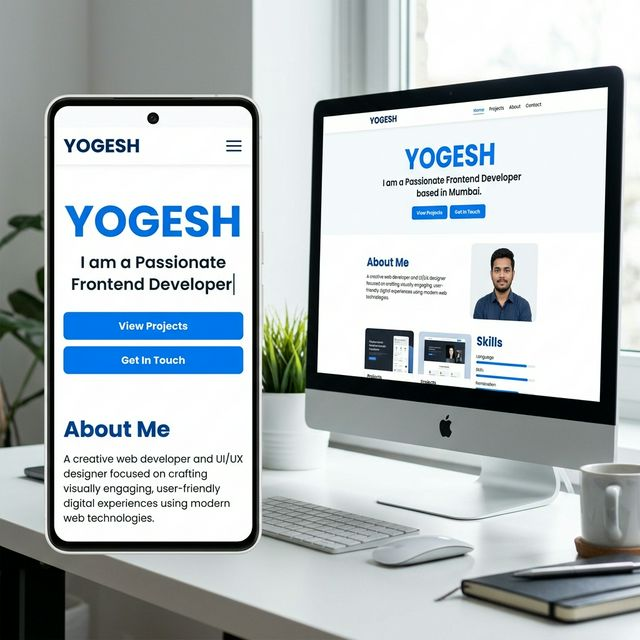

<h1 align="center">
  
</h1>

<p align="center">
  <a href="https://yogeshdevx.github.io/xportfolio" target="_blank">
    
  </a>
  &nbsp;
  
  &nbsp;
  
  &nbsp;
  
</p>

---

## ✨ Preview

### 🌅 Light Mode — Hero Section


### 🌙 Dark Mode — Sections Overview


### 🌗 Theme & Features Showcase


### 📱 Responsive on All Devices


---

## 🚀 Features

| Feature | Details |
|---|---|
| 🎨 **Light / Dark Mode** | Smooth toggle with `localStorage` preference saved |
| ⚡ **GSAP Animations** | Scroll-triggered entrance animations + hero reveal |
| ✍️ **Typed.js Role Switcher** | Auto-cycling animated text in the hero section |
| 📱 **Fully Responsive** | Mobile hamburger menu, tablet + desktop layouts |
| 🔢 **Loading Screen** | Pill-shaped animated loader with live percentage |
| 🎓 **Education Timeline** | Visual career/education journey section |
| 🛠️ **Tech Stack Grid** | Icon grid showcasing all skills |
| 📬 **Contact + Social** | Direct email and social link icons |
| ⬇️ **Resume Download** | One-click PDF resume download button |

---

## 🛠️ Tech Stack

<p align="center">
  
  
  
  
  
  
</p>

---

## 📂 Project Structure

```
xportfolio/
├── index.html              # Main HTML structure
├── style.css               # Styling, themes, responsive layout
├── script.js               # Animations, theme toggle, navigation
└── portfolio_data/
    ├── YOGESH - Resume.pdf # Downloadable resume
    ├── preview_light.png   # Light mode screenshot
    ├── preview_dark.png    # Dark mode screenshot
    ├── preview_mobile.png  # Mobile view screenshot
    └── preview_banner.png  # Feature banner
```

---

## ⚡ Getting Started

```bash
# 1. Clone the repository
git clone https://github.com/yogeshdevx/xportfolio.git

# 2. Open in browser (no build step needed)
cd xportfolio
# Just open index.html in any modern browser!
```

> **No dependencies to install** — Pure HTML, CSS & JS. Open `index.html` directly or deploy to any static host.

---

## 🌍 Deployment

This portfolio is deployed on **GitHub Pages** (or Vercel). To deploy your own:

**GitHub Pages:**
1. Push code to GitHub
2. Go to **Settings → Pages → Branch: main → / (root)**
3. Your site will be live at `https://yourusername.github.io/xportfolio`

**Vercel:**
```bash
npx vercel --prod
```

---

## 📱 Sections

- 🏠 **Hero** — Name + animated role + CTA buttons
- 👤 **About** — Short bio / introduction
- 🧠 **What I Do** — Service cards (Problem Solving, Web Dev, Backend)
- 💻 **Tech Stack** — Skills grid with icons
- 📁 **Featured Work** — Project showcase cards
- 🎓 **Education** — Career & education timeline
- 📬 **Contact** — Email + GitHub + LinkedIn + LeetCode + Instagram

---

## 🤝 Connect With Me

<p align="center">
  <a href="https://github.com/yogeshdevx" target="_blank">
    
  </a>
  &nbsp;
  <a href="https://linkedin.com/in/yogeshdevx/" target="_blank">
    
  </a>
  &nbsp;
  <a href="https://leetcode.com/u/yogeshdevx/" target="_blank">
    
  </a>
  &nbsp;
  <a href="https://instagram.com/yogeshdevx" target="_blank">
    
  </a>
  &nbsp;
  <a href="mailto:yogeshdevx@gmail.com">
    
  </a>
</p>

---

<p align="center">
  
</p>

<p align="center">Made with ❤️ by <strong>Yogesh</strong> • © 2024</p>
