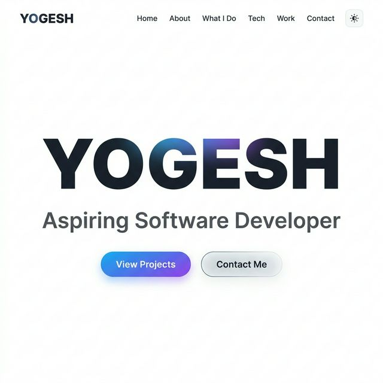

<h1 align="center">
  
</h1>

<p align="center">
  <a href="https://yogeshdevx.github.io/Portfolio/" target="_blank">
    
  </a>
  &nbsp;
  
  &nbsp;
  
</p>

---

## 👋 About This Project

Hey! I'm Yogesh, a second-year B.Tech CS student at **Chandra Shekhar Azad University of Agriculture & Technology (Campus – Etawah)**. I built this portfolio to have something to show when people ask *"do you have any projects?"* — and also because I genuinely wanted to get better at frontend stuff.

I'm into Data Structures & Algorithms and have solved 50+ problems on LeetCode so far. Still learning, still building.

It's built with plain HTML, CSS, and JavaScript — no frameworks, no npm install hell. Just open `index.html` and it works.

---

## ✨ Preview



---

## 🚀 What's Inside

| Feature | Details |
|---|---|
| 🎨 **Light / Dark Mode** | Toggle with preference saved to `localStorage` |
| ⚡ **GSAP Animations** | Scroll-triggered animations + hero reveal |
| ✍️ **Typed.js** | Animated role-switcher text in the hero |
| 📱 **Responsive** | Mobile hamburger menu + works on all screen sizes |
| 🔢 **Loading Screen** | Animated pill-shaped loader with percentage counter |
| 🎓 **Education Timeline** | My academic journey so far |
| 🛠️ **Skills Grid** | Tech I've been learning and using |
| 📬 **Contact Section** | Links to reach me |

---

## 🛠️ Tech Stack

<p align="center">
  
  
  
  
  
  
</p>

---

## 📂 Project Structure

```
Portfolio/
├── index.html              # All the HTML structure
├── style.css               # Styling, themes, responsive layout
├── script.js               # Animations, theme toggle, nav logic
└── portfolio_data/
    ├── YOGESH - Resume.pdf # My resume (PDF)
    └── preview_light.png   # Screenshot for this README
```

---

## ⚡ Running Locally

```bash
# Clone it
git clone https://yogeshdevx.github.io/Portfolio/
cd Portfolio

# No installs needed — just open index.html in any browser
```

> Pure HTML/CSS/JS — no build tools, no node_modules. It just works.

---

## 📱 Sections

- 🏠 **Hero** — Name, animated role text, and CTA buttons
- 👤 **About** — A quick intro about me
- 🧠 **What I Do** — Problem Solving, Web Dev, Backend Systems
- 💻 **Tech Stack** — Skills I've picked up so far
- 📁 **Projects** — Scientific Calculator + more coming
- 🎓 **Education** — B.Tech CSE @ CSAUAT Etawah
- 📬 **Contact** — Ways to reach me

---

## 🤝 Find Me Here

<p align="center">
  <a href="https://github.com/yogeshdevx" target="_blank">
    
  </a>
  &nbsp;
  <a href="https://linkedin.com/in/yogeshdevx/" target="_blank">
    
  </a>
  &nbsp;
  <a href="https://leetcode.com/u/yogeshdevx/" target="_blank">
    
  </a>
  &nbsp;
  <a href="https://instagram.com/yogeshdevx" target="_blank">
    
  </a>
  &nbsp;
  <a href="mailto:yogeshdevx@gmail.com">
    
  </a>
</p>

---

<p align="center">
  
</p>

<p align="center">Made with ❤️ by <strong>Yogesh</strong> • B.Tech CSE @ CSAUAT Etawah</p>
